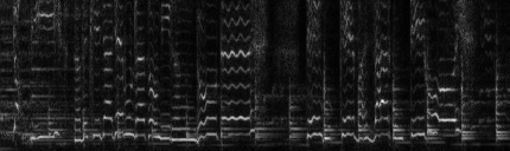

AudioFile.h is licensed  Copyright (C) 2017  Adam Stark under GPL

simplecanvas is based off of the STB Image library, Copyright (C) 2017 Sean Barrett

## Computing And Viewing Spectrograms

The program <code>plotSpectrogram</code> will create an image of a spectrogram of an audio clip

As an example, let's say we wanted to do an STFT on the example query "despacitoClean.wav" provided with this code, using a window length of 1024, a hop length of 512, and a cutoff of 128 frequency bins.  Then we'd run this:

~~~~~ bash
./plotSpectrogram --audiopath ExampleQueries/despacitoClean.wav --impath spectrogram.png --win 1024 --hop 512 --maxBin 128 --scale 4
~~~~~

And we will get the image

